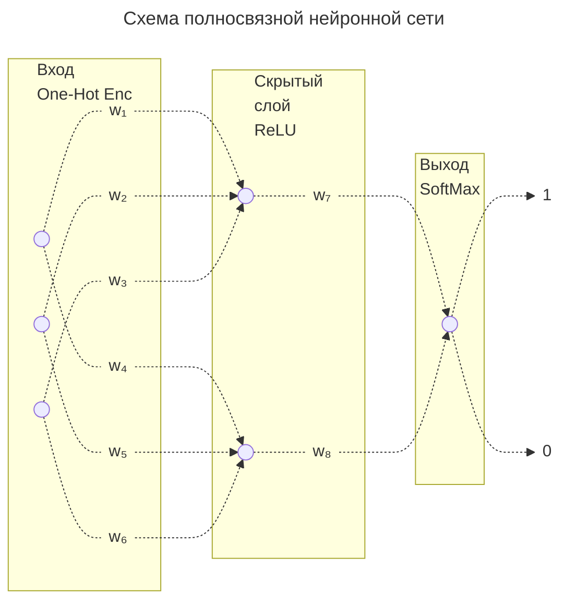
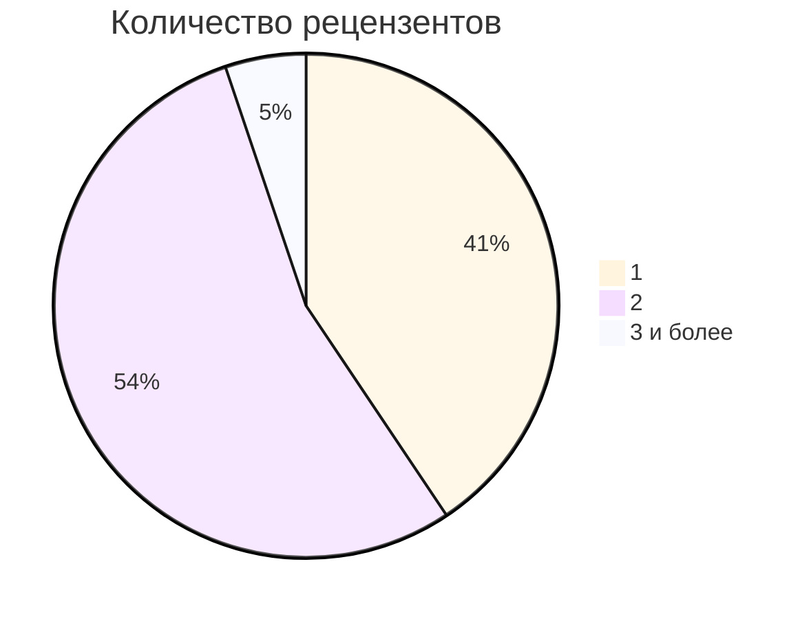

---

## Description languages

This README is available in two languages:
- Russian version below 🇷🇺
- English version follows 🇬🇧

---

# Автоматизация предрецензирования научных рукописей

## Для сотрудников редакций научных журналов

Эта система помогает до направления на рецензирование:
- оценивать вероятность опубликования рукописи,
- определять рецензентов,
- делать краткий парафраз всего текста.

### Важно:
- система не заменяет экспертную оценку рецензентами,
- система не принимает финального решения о публикации и не гарантирует правильность решения,
- система не работает "из коробки"; для работы системы необходимо собрать **опубликованные и отклоненные** рукописи вашего журнала и обучить (дообучить) на этих текстах модель машинного обучения.

### Как это работает

1. Собираются рукописи научного журнала (неопубликованные с пометкой 0, опубликованные - 1). 
2. Текст каждой рукописи разбирается по словам. 
3. Слова рукописи преобразуются в большой вектор, где в качестве координаты - присутствие слова из словаря всех рукописей. 
4. В координату вектора рукописи ставится 1 если слово есть в рукописи и 0 иначе. 
5. Вектора загружатся в нейросеть. 
6. Нейросеть распознает путь неопубликованной рукописи к выходу с числом 0, а опубликованной числом 1 и обучает веса (w картинке ниже) проходить к нужным выходам 0 или 1 рукописям с соответствующими метками (0 или 1). 
7. Новая рукопись проходит по обученным весам к решению 0 или 1, или к вероятности опубликования. 
8. Решение за редактором.



В приведенной выше нейросети 3 входа для данных, 2 нейрона на скрытом слое, один выход и всего 8 весов. В реальной сети 35549 входов для данных, 128 нейронов на скрытом слое, один выход и 4 550 658 обучаемых весов.

## Пример сценария использования

В исследуемом научно-техническом журнале «Вестник Концерна ВКО "Алмаз – Антей"» в год в среднем поступает 100 рукописей из которых 60 отклоняется и 58 из 60 - на первом раунде рецензирования. В среднем на каждую рукопись назначается 2 рецензента и если на каждый приходящий текст из 58 с низкой вероятностью опубликования назначать только 1 рецензента, то экономия времени рецензентов будет

$$
1-\frac{(40 + 2)\cdot 2+58 \cdot \mathbf{\textcolor{red}{1}}}{(40 + 2)\cdot 2+58 \cdot \mathbf{\textcolor{red}{2}}}\approx 29\\%
$$

в результате
- уменьшается нагрузка на рецензентов,
- быстрее принимаются редакторские решения при направлении на рецензирование.

Приложение может использоваться сотрудниками редакций научных журналов без опыта и без глубоких знаний научной предметной области, что сильно экономит время когда, например, старший редактор в отпуске или в командировке.


Количество рецензентов, назначаемых на поступающие рукописи в российских научных журналах (данные elibrary.ru) приведено на круговой диаграмме ниже



Как видно из диаграммы почти 60% российских научных журналов назначает двух и более рецензентов на рукопись, поэтому выгоду от использования данного приложения могут получить более половины журналов.

## Описание

> [!IMPORTANT]
> Это "обёртка" (*frontend*) над языковыми моделями, которая не будет работать при загрузке. 
> По этическим соображениям в репозиторий не загружены:
> - предобученная на корпусе текстов модель полносвязной нейронной сети `model_checkpoint.pth`, 
> - файл `1_6.xlsx` с фамилиями рецензентов,
> - предобработанный корпус `clean_texts_articles_6.pkl` опубликованных статей и неопубликованных рукописей.


Для запуска и работы проекта необходимы:
1. Опубликованные статьи и неопубликованные рукописи конкретного научного журнала (хотя бы 300 штук);
2. Информация о рецензентах этих статей и рукописей;
3. Обучение (дообучение) моделей:
	1. Полносвязной нейронной сети или трансформера (современной модели глубокого обучения для анализа текстов) для определения вероятности опубликования;
	2.  `CountVectorizer` или `bge-m3` для определения рецензентов;
*Python*-скрипты для обучения (дообучения) моделей машинного обучения приведены в репозитории в папке `train_and_inference_model`.

### Интерфейс


### Архитектура модели
- Препроцессинг текст
	- загрузка текста в формате `*.txt`
	- предобработка текста (удаление стоп-слов, лемматизация, нижний регистр)
	- векторизация или создание эмбеддингов текста
- Оценка вероятности публикации (*FFNN* или *ruSciBERT* / *Longformer* при наличии вычислительных ресурсов)
- Подбор рецензента (косинусное расстояние *CountVectorizer* или *bge-m3* при наличии вычислительных ресурсов)
- Парафраз текста (`cointegrated/rut5-base-absum` или `Qwen/Qwen2.5-32B-Instruct` при наличии вычислительных ресурсов)
- Интерфейс и запуск
	- *Flask* (*Python*), с *HTML*, *CSS* и *JavaScript* для веб-интерфейса
	- Возможен запуск через `Docker` или из консоли командой `python python-py.py`

### Требования к ресурсам
- Минимальная конфигурация (предобученная *FFNN*, косинусное расстояние *CountVectorizer* и парафразер `cointegrated/rut5-base-absum`): офисный ноутбук.
- Для использования продвинутых моделей (*ruSciBERT*, *Qwen*) требуется *GPU* с не менее 12 ГБ памяти.
- При использовании максимальной конфигурации в виде моделей `kazzand/ru-longformer-base-4096` и/или `Qwen/Qwen2.5-32B-Instruct` требуется ускоритель с 90 *GB GPU* (например, *NVIDIA RTX PRO 6000 Blackwell Server Edition 96GB GDDR7*).

### Требования к данным
- Минимальное количество рукописей - 300 (для получения доли правильных ответов $\approx$ 80%);
- Баланс классов - желателен 50 на 50%;
- Данные обо всех рецензентах загружаемых в модель статей.

### Пример входа/выхода

#### Входные данные

Текст в формате `*.txt` в `UTF-8` кодировке на русском языке (все символы других языков из текста удаляются). Из пришедшего на публикацию `Word`-файла требуется скопировать всё содержимое в текстовый документ `*.txt` и загрузить в приложение через *HTML*-форму браузера.

Файл переводится в переменную `content` и используется в трех функциях
```python
    content = file.stream.read().decode('utf-8')
```

```text
УДК 621.396.96

Робастные алгоритмы оценки параметров сложных сигналов

Радинников А. В., Корневедов Г. О., Лосотросик В. Н.

В рамках анализа стохастических процессов в радиотехнических цепях рассматривается влияние нелинейных искажений на спектральную плотность мощности выходного сигнала. Проведена оценка корреляционных функций случайных последовательностей, модулированных по фазе и амплитуде, с учётом дисперсии фазового шума. Установлено, что при увеличении коэффициента затухания наблюдается экспоненциальное снижение уровня побочных гармоник в полосе пропускания фильтра. Полученные результаты могут быть использованы для оптимизации параметров адаптивных алгоритмов фильтрации в условиях нестационарных помех.
...
```

#### Выходные данные
Результат работы трех функций
```python
    published_result = published(content)
    review_result = reviewer(content)
    paraphrase = T5paraphrase(content)
```
которые можно свести к `json` файлу
```json
{
  "published_result": 0.231,
  "review_result": "Иванов, Петров, Сидоров",
  "paraphrase": "Рост коэффициента затухания экспоненциально снижает уровень побочных гармоник в спектре сигнала. Эти данные позволяют оптимизировать адаптивную фильтрацию при нестационарных помехах."
}
```

|Название статьи| Авторы| Вероятность публикации| Рецензенты| Краткое содержание|
|:-|:-|:-|:-|:-|
|Робастные алгоритмы оценки параметров сложных сигналов|Радинников А. В., Корневедов Г. О., Лосотросик В. Н.| 0.231|Иванов, Петров, Сидоров|Рост коэффициента затухания экспоненциально снижает уровень побочных гармоник в спектре сигнала. Эти данные позволяют оптимизировать адаптивную фильтрацию при нестационарных помехах.|

### Характеристики работы моделей (*model performance*)
Лучшие характеристики при классификации текстов корпуса из 923 рукописей с примерно равным распределением принятых статей и отклонённых рукописей (52 на 48%):
* определении вероятности опубликования - *BERT*-модель, предобученная на большом корпусе научных текстов на русском языке, – `ai-forever/ruSciBERT` ($\mathbb{E}[accuracy]\approx89\\%$, то есть правильно распознается 9 из 10 рукописей);
* определение рецензентов путём поиска рукописи, наиболее близкой к вновь пришедшей по косинусному расстоянию и выводу рецензетов, которые уже видели максимально похожий материал, мультифункциональная модель – `BAAI/bge-m3` ($accuracy\approx98\\%$, то есть правильно распознаются рецензенты в 49 из 50 рукописей);
* по парафразу дают – семейство моделей *Qwen*, но лучшая – `Qwen/Qwen2.5-32B-Instruct` (метрика – субъективное восприятие парафраза собственной статьи).

## Лицензия


Этот проект распространяется под лицензией [CC BY-NC](https://creativecommons.org/licenses/by-nc/4.0/) (Creative Commons Attribution-NonCommercial).

## Этапы проекта
1. Собрать корпус текстов, рассмотренных рецензентами научно-технического журнала «Вестник Концерна ВКО „Алмаз – Антей“» (опубликованные статьи и отклоненные рукописи).
2. Предобработать корпус:
	1. Провести очистку от служебных слов (УДК, *DOI*, Список литературы, "Рис." и т. д.);
	2. Удалить стоп-слова (предлоги, частицы, междометия, знаки препинания и т. д.);
	3. Провести лемматизацию (для существительного и прилагательного – именительный падеж, единственное число; для прилагательного – еще и мужской род; для глаголов, причастий и деепричастий – неопределенная форма глагола несовершенного вида);
	4. Привести все слова к нижнему регистру букв.
3. Перевести все тексты корпуса через векторайзеры или эмбеддинги в числовой вид.
4. Обучить модели классификации, которые будет применяться к вновь пришедшей рукописи с целью определения вероятности её публикации (или бинарной классификации)
	1. Классические методы машинного обучения (*machine-learning*) или далее *ML*-методы
	2. Методы глубинного обучения (*deep-learning*) или далее *DL*-методы
	3. Трансформеры (*transformers*)
5. Применить методы определения косинусного расстояния с целью определения текста наиболее близкого к поступившей рукописи. Если тексты близки, то на вновь пришедшую статью можно назначить тех же рецензентов, что уже были назначены на статью из корпуса.
6. Сделать парафраз всего текста статьи для получения краткого изложения сути проведенных исследований с целью отправки в электронном письме рецензенту не только полного текста рукописи, но и выжимки текста всей рукописи. По опыту, парафраз чаще приводит к быстрому ответу рецензента если тематика не близка.
7. Сделать пригодный для использования редакциями научных журналов интерфейс.

## "Инструменты" проекта
### Веб-технологии
- библиотека *Flask* языка *Python*
- *CSS*
- *HTML*
- *JavaScript*
### Контейнеризация
- *Docker*
### Модели машинного обучения
- предобученные модели с *HuggingFace* ( `ai-forever/ruSciBERT`, `BAAI/bge-m3`, `Qwen/Qwen2.5-32B-Instruct`)
- полносвязная нейронная сеть из библиотеки `PyTorch`
- классические модели машинного обучения из библиотеки `scikit-learn` (`LogisticRegression`, `KNeighborsClassifier`, `GaussianNB`, `GradientBoostingClassifier`, `RandomForestClassifier`)
- `FastText`
### Векторайзеры и эмбеддинги
- векторайзеры `HashingVectorizer`, `TfidfVectorizer`, `CountVectorizer`
- эмбеддинги `Doc2Vec`, `Word2Vec`
### Предобработка естественного языка
- библиотека для морфологического анализа (морфологического анализатора и генератора) `pymorphy3`
- открытая библиотека для обработки естественного языка `nltk`
- регулярные выражения (специальный язык шаблонов для поиска, сопоставления и обработки текста) `re`

## Интересный результат
1. Простая полносвязная нейронная сеть (*FFNN*) с векторайзером `OneHotEncoder` даёт результат в метрике `accuracy` выше, чем та же полносвязная нейронная сеть с более продвинутыми векторайзеры `CountVectorizer`, `TfidfVectorizer` и `HashingVectorizer`. 
2. Аналогичный результат получен при использовании классических методов машинного обучения, а именно использование векторайзера `OneHotEncoder` (`CountVectorizer(binary=True)`) с методом классификации `LogisticRegression` даёт метрику `accuracy` лучше чем у более продвинутых методов вроде градиентного бустинга (`GradientBoostingClassifier`) или случайного леса (`RandomForestClassifier`).
3. Но лучшие результаты дают модели на основе трансформеров и даже простейшая `DistiledBERT` модель даёт результат на несколько процентов лучше, чем самый лучший результат на полносвязной нейронной сети.

## Описание исходных данных

> [!IMPORTANT]
> Тексты рукописей были взяты из научно-технического журнала «Вестник Концерна ВКО "Алмаз – Антей"» (с 2011 по 2024 годы). Опубликованные тексты можно найти в интернете, не опубликованные нет. Тематика статей в журнале: радиотехника, машиностроение, информатика, газодинамика.

### Тексты рукописей
Для обучения модели использовались текстовые файлы в формате `*.txt` с кодировкой `UTF-8`. В названии файла была введена позиционная и буквенная кодировка

|Название файла|Расшифровка|
|:-|:-|
|0001РП.txt| 0001 - Первый файл, Р - радиолокация, П - принята к публикации|
|0254ГО.txt|0254 - 254 по номеру файл, Г - газодинамика, О - отклонена к публикации|

Используемые для кодировки буквы в пятом символе названия файла:

|Буква|Тематика|
|:-|:-|
|А | Автоматика|
| В | Внешняя тематика|
| Г | Газодинамика|
| Д | обработка Давлением|
| И | Информатика|
| М | Машиностроение|
| Р | Радиолокация|
| Т | Теплофизика|

Используемые для кодировки буквы в шестом символе названия файла
|Буква|Решение|
|:-|:-|
| О | рукопись отклонена к публикации|
| П | рукопись принята к публикации|

### Информация о рецензентах
*Excel*-файл вида
|Название файла|Название статьи|Авторы|Дата поступления|Рецензенты|
|:-|:-|:-|:-|:-|
|0001РО.txt|Робастные алгоритмы оценки параметров сложных сигналов|Радинников А. В., Корневедов Г. О., Лосотросик В. Н.|5/4/2012|Иванов, Петров, Сидоров|
|0002ГП.txt|Исследование ледообразования на винглетах|Нароян В. П., Ведородов Л. С., Рогожицын С. С.|12/4/2012|Железняк, Антонец, Яблоков|

Можно упростить данный *Excel*-файл оставив только название статьи и фамилии рецензентов или только дать название статей, а рецензентов по этим файлам уже подберет редактор, но тогда нужно внести изменения в код файла `python-py.py`

```python
    return df__11.loc[best_match_idx][4]
```
Заменить цифру 4 на нужный столбец с рецензентами или выбрать 0 что вывода только названия текстового файла, по которому самостоятельно определить рецензентов.

> [!IMPORTANT]
> Для ускорения работы приложения и достижения предельных характеристик *Time to First Token* (*TTFT*) на портативном ноутбуке в коде модели на *github* используются не самые лучшие, но работающие:
> - Предобученная полносвязная нейронная сеть (*FFNN*) с векторайзером *OneHotEncoder* для определения вероятности опубликования (*TTFT* - 1 секунда). Полный инференс лучшей модели `ai-forever/ruSciBERT` требует ускорителя не менее *T*4 с 11,8 *GB GPU* и времени менее 1 секунды, однако на *CPU* инференс модели занимает 40 секунд.
> - Модель `CountVectorizer` вместо модели `BAAI/bge-m3` для определения рецензента (*TTFT* - 2 секунды). Полный инференс модели `BAAI/bge-m3` на *CPU* достигает 83 часов, а при использовании *G*4 c 90 *GB GPU* - 3 минуты (на ускорителе *T*4 с 15 *GB GPU* примерно 20 минут);
> - Модель `cointegrated/rut5-base-absum` c *TTFT* чуть менее 30 секунд при загрузке фрагмента текста от 200 до 700 символов рукописи (не всей рукописи). Лучшая исследованная модель для парафраза `Qwen/Qwen2.5-32B-Instruct` требует для инференса 90 *GB GPU* и три минуты машинного времени ускорителя.


## Файловая структура проекта
```text
.
├── 1_6.xlsx # excel файл c информацией о рецензентах; не загружен на github
├── absum # не загружена на github но находится в свободном доступе на hugging face `cointegrated/rut5-base-absum`
│   ├── config.json
│   ├── gitattributes.txt
│   ├── model.safetensors
│   ├── pytorch_model.bin
│   ├── README.md
│   ├── special_tokens_map.json
│   ├── spiece.model
│   └── tokenizer_config.json
├── clean_texts_articles_6.pkl # предобработанные статьи; не загружен на github
├── Dockerfile # docker file c инструкциями для приложения Docker для создания изолированного контейнера со всеми завимимостями проекта, которые могут работать в любой среде (*Windows*, *Linux*, *MAC OS*)
├── licence # файл лицензии
├── model_checkpoint.pth # предобученная модель полносвязной нейронной сети; не загружена на github
├── python-py.py # Основной файл с приложением на Pyhton(Flask)
├── readme.md # этот readme.md файл
├── requirements.txt # файл зависимостей для создания *Docker* контейнера
├── screenshot.png # скриншот работы программы
├── static
│   ├── css
│   │   └── style.css # стили CSS (Cascading Style Sheets) для визуального оформления программы
│   ├── images
│   │   ├── favicon.svg # фавикон (иконка в трее или в строке браузера) для графического отображения приложения
│   │   └── logo.svg # логотип (иконка) для графического отображения приложения
│   └── js
│       └── main.js # файл со скриптами *javascript* которые делают приложение интерактивным (ввод файла, отображение работы приложения и т. д.)
├── templates
│   └── index.html # основной HTML-файл с HTML-кодом приложения
└── train_and_inference_model
    ├── choice_of_reviewers
    │   └── cosine_similarity.py # python-код для обучения модели, которая определяется рецензента. на офисном ноутбуке выполнение этого кода может достигать трех суток, на ускорителе хотя бы с 15 *GB GPU* менее 20 минут. Эта модель самая точная!
    ├── classification
    │   ├── ffnn_for_github.py # python-код для обучения простейшей полносвязной нейронной сети с простым векторайзером OneHotEncoder. 
    │   ├── longformer_for_github.py # python-код для обучения трансформерной модели нейронной сети. Работает с длинными текстами, но требует не менее 90 *GB GPU*
    │   └── ruscibert_for_github.py # python-код для обучения трансформерной модели нейронной сети ruSciBERT, предобученной на текстах на русском языке. Требует не менее 15 *GB GPU*.
    └── paraphase
        └── qwen_paraphase.py # python-код для обучения трансформерной модели парафразера. Самая лучшая модель  `Qwen/Qwen2.5-32B-Instruct` требует не менее 90 *GB GPU*.
```

## Как использовать

1. Собрать исторические данные:
	- опубликованные статьи и неопубликованные рукописи в формате `*.txt`
	- в название файла обязательно указать решение по статье или рукописи (например `00001П.txt`  - "П" - принята, `00002О.txt` - "О" - отклонена)
	- собрать в *Excel*-файл данные о рецензентах каждого текстового файла (`00001П.txt`; `Иванов, Петров, Сидоров`)
2. Обучить модели на исторических данных (скрипты лежат в папке проекта `train_and_inference_model`) и убедиться, что обученные модели сохранены в папке проекта.
3. Запустить `python python-py.py` или контейнер в `Docker`.
4. Ввести в строке браузера `localhost`.

## *FAQ* (часто задаваемые вопросы)

### Общие вопросы о приложении и его возможностях

#### Q: Для кого эта система?
A: Для сотрудников редакций научных журналов.

#### Q: Что мне нужно для начала работы?
A: Исторические данные о рукописях и рецензентах этих рукописей.

#### Q: Почему проект не работает "из коробки"?
A: Потому что модель машинного обучения нужно обучить (дообучить) на данных конкретного научного журнала.

#### Q: Сложно ли это реализовать?
О: Это требует подготовки данных и знаний в обучении и инференсе (применении) машинных моделей, в том числе нейросетевых.

#### Q: Это бесплатно?
A: Да, но не для коммерческого использования. При коммерческом использовании требуется сделать рефакторинг кода.

#### Q: Может ли приложение полностью заменить рецензента?
A: Нет, приложение в основном предназначено для сотрудников редакций научных журналов для поддержки принятия решений о назначении рецензентов при поступлении новой рукописи.

#### Q: Какой язык рукописей?
A: Русский.

#### Q: Можно ли использовать приложение для журналов на других языках?
A: В текущей версии поддерживается только русский язык рукописей. Для использования на других языках требуется переобучения модели и/или приведение к одному языку.

#### Q: Можно ли интегрировать приложение с редакционными системами?
A: Да, при необходимости возможна интеграция с внешними системами через API или импорт/экспорт данных.

#### Q: Как обеспечивается конфиденциальность данных?
A: Все данные хранятся и обрабатываются на серверах редакции или персональных компьютерах работников редакции; приложение не передаёт информацию третьим лицам или в общедоступные поисковики или чат-боты.

#### Q: Под какой лицензией распространяется ПО?
A: CC BY-NC (Creative Commons Attribution-NonCommercial).

#### Q: Есть ли ограничения по количеству рукописей или рецензентов?
A: Ограничения зависят от производительности системы и объёма базы данных. Ограничений по использованию системы даже для журналов с архивами более 200 лет нет.

#### Q: Поддерживается ли работа с несколькими журналами или редакциями одновременно?
A: В текущей версии приложение предназначено для работы с одной редакцией и одной базой данных. Для одновременной работы с несколькими журналами потребуется использование приложений с разными предобученными *NLP* моделями и разными *Excel* файлами с данными о рецензентах.

#### Q: Может ли приложение показать, какие именно абзацы или фразы в новой рукописи совпали с похожей старой, чтобы редактор мог быстро убедиться в релевантности?
A: Нет

#### Q: Как часто выходят обновления приложения?
A: Обновления выходят по мере необходимости, обычно после обнаружения ошибок, добавления новых функций или улучшения моделей.

### Технические требования, установка и запуск
#### Q: Почему приложение не работает при скачивании и запуске `python-py.py`?
A: Приложение для корректной работы требует данные конкретного научного журнала. Данные на которых обучалась модель (рецензенты, рукописи) бесполезны для другого журнала, поэтому для запуска модели требуется собрать опубликованные статьи и неопубликованные рукописи конкретного журнала, данные о рецензентах и переобучить модели машинного обучения.

#### Q: Каковы минимальные системные требования для запуска приложения?
A: Предобученная полносвязная нейронная сеть для классификации рукописи, простое определение косинусного расстояния методом `CountVectorizer` и парафразер  `cointegrated/rut5-base-absum` работают на офисном ноутбуке. Использование предобученной модели `ai-forever/ruSciBERT` для классификации, модели `BAAI/bge-m3` для определения рецензента и модели `Qwen/Qwen2.5-32B-Instruct` для парафраза требует видеоускорителя с не менее чем 12 *GB GPU*.

#### Q: Обязателен ли `Docker`?
A: Нет, приложение может запускаться из консоли командой `python python-py.py`, но для этого требуется установленный `Python` версии не ниже `3.10`.

#### Q: Сколько времени занимает обработка одной новой рукописи?
A: Зависит от используемых моделей и доступных ресурсов. Минимальное время на минимальных моделях и офисном компьютере в пределах 40 секунд.

#### Q: Требуется ли подключение к интернету для работы приложения?
A: Нет для контейнеризированного приложения в `Docker` где все библиотеки и файлы уже предзагружены в контейнер и да для запуска из командной строки. 

#### Q: Почему при скачивании и запуске *Docker*-образа приложение всё равно не работает без дополнительных файлов?
A: *Docker*-файл упаковывает только веб-обёртку и код. Образ не содержит чувствительных данных (*Excel*, обученные модели, корпус). Поэтому даже в контейнере нужно будет смонтировать внутрь вашу собственную папку с этими файлами. Контейнер не решает проблему отсутствия данных журнала.

#### Q: Обязательно ли использовать видеоускоритель (*GPU*) для работы приложения?
A: Нет. Приложение может работать на обычном офисном ноутбуке, если использовать предобученную полносвязную нейронную сеть и простой `CountVectorizer`.

#### Q: Что будет, если *Excel*-файл с базой рецензентов открыт в другом окне (например, редактор правит его) в момент запуска приложения?
A: Лучше закрыть Excel-файл.

#### Q: Что произойдет, если в папке с архивом окажется пустой текстовый файл или файл с неверной кодировкой (не *UTF*-8)?
A: Пустой файл обработается и выдаст всегда один и тот же результат. Файл с неверной кодировкой выдаст ошибку.

#### Q: Почему для работы с продвинутыми моделями (например, BERT) требуется видеокарта с большим объёмом памяти?
A: Трансформерные модели, такие как *BERT* или *Qwen*, содержат миллионы параметров и требуют значительных вычислительных ресурсов для обработки текста. Без *GPU* с достаточным объёмом памяти (от 12 ГБ) инференс (работа модели) будет происходить крайне медленно (например, модель `BAAI/bge-m3` на *CPU* и 1000 статей объемом в среднем 10000 токенов считается 83 часа) или станет невозможен из-за нехватки ресурсов.

### Данные, обучение и переобучение модели

#### Q: Какие данные требуются для обучения модели?
A: Только тексты рукописей в формате `*.txt`. Объем зависит от необходимого значения доли правильных ответов (далее  `accuracy`): для accuracy в 80% достаточно 300 рукописей на самой лучшей модели `ai-forever/ruSciBERT`, для получения 99% `accuracy` возможно придется собрать 5000 рукописей. Очень желательно соблюдать баланс классов в 50 на 50%, то есть чтобы количество принятых и отклоненных рукописей в обучающей выборке были распределены поровну.

#### Q: Можно ли использовать модель для другого журнала?
A: Да, после переобучения модели (исходный код для переобучения включен в репозиторий), добавления файла с именами рецензентов и загрузки предобработанных рукописей.

#### Q: Можно обучать модели на компьютере или ноутбуке?
A: Только простые модели. Трансформеры требуют *GPU*.

#### Q: Как часто рекомендуется переобучать модели подбора рецензентов?
A: Рекомендуется переобучать модели после каждого принятого решения по отдельной рукописи (отклонена/принята).

#### Q: Сколько времени займет переобучение?
A: Зависит от количества данных и имеющихся ресурсов. При сборе 1000 статей полное переобучение модели *ruSciBERT* на ускорителе *T*4 занимает в пределах 10-15 минут, после чего модель сразу можно использовать.

#### Q: Что будет, если я загружу рукопись с формулами, таблицами или списком литературы в 200 источников? Приложение обработает это корректно?
A: Нет, оно просто удалит все символы, не являющиеся буквами русского языка. Формулы, таблицы, ссылки на литературу, УДК, *DOI* и даже рисунки будут вырезаны регулярными выражениями. Система работает только с чистым текстом (словами). Остальное она игнорирует.

#### Q: Какие форматы файлов поддерживает приложение?
A: Приложение работает с текстовыми файлами рукописей и структурированными данными о рецензентах (например, CSV или Excel).

#### Q: Есть ли риск «переобучить» модель, если я буду слишком часто обновлять базу новыми рукописями? Как часто это реально нужно делать?
A: Нет, риска нет. Рекомендуется переобучать модель после каждого принятого решения по рукописи. Но технически для этого требуется *ML*-инженер (не редактор), так как данное приложение это скорее *MVP* (*minimum viable product*) и для полноценного приложения нужно полноценная разработка, где можно учесть все возможные варианты подачи рукописей в модель и её обучения. Это ещё не сделано в том числе и потому, что неизвестно будут ли в наличии вычислительные ресурсы.

#### Q: Что будет, если в одной строке `Excel` в столбце «Рецензенты» указаны люди, которых уже нет в журнале (уволились, умерли)?
A: В любом журнале рецензенты связаны. Нужно использовать граф-связей рецензентов и брать рецензентов, которые рецензировали совместно (более подробно https://github.com/denisbolshakoff/to_analyze_the_connectivity_of_reviewers).

#### Q: Почему ключевые данные (модель, корпус, *Excel* с рецензентами) не выложены в репозиторий, если проект позиционируется как исследовательский? Как другие учёные могут проверить выводы?
A: Данные не публикуются по этическим и юридическим соображениям: они содержат неопубликованные рукописи и персональные данные рецензентов. Для воспроизводимости исследования можно: (1) использовать синтетические данные, (2) запросить доступ к данным у авторов при соблюдении NDA, (3) воспроизвести методику на открытом корпусе (например, *arXiv*), адаптировав код.

#### Q: Переобучение модели — это автоматический процесс, запускаемый одним действием редактора, или требует участия ML-инженера (очистка данных, разметка, запуск обучения)?
A: Требуется участие *ML*-инженера или редактора со знаниями *NLP* и опыта программирования в *Python*.

#### Q: Есть ли ограничения по длине или объёму рукописи для анализа?
A: Максимальный объем текстового файла загружаемого в приложение - 16 МБ. Объем текста романа "Война и мир" на русском языке - 4 МБ.

#### Q: Можно ли использовать базу данных в формате SQL вместо Excel?
A: Да, но требуется доработка кода программы.

#### Q: Что делать, если после обновления базы (добавления новых статей) качество подбора ухудшилось? Можно ли «откатиться» назад?
A: Да если сохранились исторические данные и новые рукописи добавляются в систему методов увеличения индекса файла (`0001.txt`, `0002.txt`, `0003.txt` и т.д.), но потребуется переобучение модели на старых данных или сохранения версий обученных ранее моделей.

#### Q: Сколько времени и ресурсов потребуется, чтобы адаптировать систему под новый журнал с нуля?
A: Минимальный сценарий: сбор 300+ рукописей (принятых/отклонённых), подготовка *Excel* с рецензентами, предобработка текстов — 2–4 недели работы редактора + примерно 1–2 дня вычислений на обучение с подгонкой моделей. Для использования трансформерных моделей потребуется специалист по машинному обучению и инфраструктура с *GPU*. На сбор почти тысячи статей у автора ушло примерно три месяца, но без отрыва от основной работы. На обработку одной статьи уходит в от 2 до 6 минут, откуда 300 статей - от 10 до 30 часов работы, 1000 статей - от 33 до 100 часов работы.

#### Q: Что если журнал публикуется на нескольких языках? Нужно ли обучать отдельную модель для каждого?
A: Да. В текущей версии поддерживается только русский язык. Для многоязычных журналов потребуется: (1) либо привести все тексты к одному языку (перевод), (2) либо обучить отдельные модели под каждый язык, (3) либо использовать многоязычные трансформеры (например, *xlm-roberta*), что потребует дополнительной валидации.

#### Q: Как часто обновляется база данных рецензентов?
A: Обновление базы данных зависит от политики редакции журнала; приложение не обновляет данные автоматически. Оптимально обновлять базу данных рецензентов после каждого принятого решения по рукописи (принять к публикации или отклонить).

#### Q: Что происходит с рукописью после обработки? Сохраняется ли она в архиве для обучения будущих подборов?
A: Приложение не автоматически добавляет новую рукопись в базу. Обновление базы данных рецензентов и архива рукописей должно выполняться редакцией  после принятия решения по рукописи путем переобучения модели введением новых данных.

### Принцип работы, подбор рецензентов и обработка текстов

#### Q: Как приложение подбирает рецензентов?
A: Приложение подбирает рукопись которая наиболее близкая по величине определенной метрики (косинусному расстоянию) и по этой рукописи выдает рецензентов, которые уже рассматривали похожий материал.

#### Q: Нужно ли вручную вводить данные о рецензентах?
A: Нет, нужен `Excel` файл с фамилиями рецензентов и названиями текстовых файлов исследуемых статей.

#### Q: Как приложение обрабатывает рукописи сложной структуры (формулы, таблицы, списки литературы)?
A: Никак. Приложение работает только с текстом рукописи.

#### Q: Как система обрабатывает опечатки или разные варианты написания одной фамилии в Excel-файле (например, «Иванов» и «Ivanov» или «Королёва» и «Королева»)?
A: Опечатки не обрабатываются.

#### Q: Может ли приложение выделить из новой рукописи список литературы и исключить авторов из этого списка из числа рецензентов (чтобы избежать конфликта интересов)?
A: Нет

#### Q: Может ли один и тот же рецензент быть назначен на две разные рукописи подряд?
A: Да, если в исходном Excel-файле для двух похожих рукописей указаны одни и те же рецензенты, приложение не проверяет уникальность назначений и не учитывает «загрузку» рецензента.

#### Q: Что будет, если для двух разных рукописей из архива (похожих с новой) указаны противоречащие рецензенты (например, Сидоров указан в одной строке, а Петров — в другой, и они не пересекаются)? По какому принципу система выберет итоговый набор рецензентов?
A: Система даёт список рецензентов. Выбор за сотрудником редакции.

#### Q: Как система обрабатывает рукописи на стыке нескольких научных дисциплин?
A: Система подбирает наиболее похожую рукопись по всему тексту, не выделяя отдельные дисциплины. Если рукопись междисциплинарная, подбор будет по наиболее близкой по содержанию статье из архива. Точность подбора близка к 100% но не равна ей из-за отдельных рукописей, которые пишутся на стыке специальностей.

#### Q: Что делать, если в базе данных журнала нет похожих рукописей для подбора рецензентов?
A: Модель в любом случае подберёт рукописи по максимуму косинусного расстояния, даже если это расстояние будет близко к нулю. То есть в журнале по радиотехнике можно найти рецензентов по тематике балета, но, конечно, гарантировать, что рецензент возьмется за не близкую ему тематику нельзя.

#### Q: Учитывает ли система конфликт интересов (например, если рецензент — соавтор статьи)?
A: Нет

### Интерпретируемость, качество и ограничения модели
#### Q: Что, если модель неверна?
A: Модель используется как инструмент поддержки приянятия решений, а не как лицо, принимающее окончательное решение. 

#### Q: Может ли модель быть предвзятой?
A: Да, в зависимости от данных обучения. Например, в используемых данных есть 5 рукописей по очень узкой области микромеханики, которые были отклонены и только 1 рукопись, которая принята. При обучении модели на 5 непринятых рукописях по микромеханике, принятая рукопись в тестовой выборке всегда распознается с низкой вероятностью опубликования.

#### Q: Почему система не объясняет, почему она дала низкую вероятность публикации или предложила конкретных рецензентов? Как редактор аргументирует решение автору?
A: В текущей версии модель работает как «чёрный ящик». Интеграция методов интерпретируемости (*LIME*, *SHAP*, *attention*-визуализация) технически возможна, но требует дополнительной разработки и вычислительных ресурсов. Пока редактор принимает окончательное решение на основе своей экспертизы, используя рекомендации системы как вспомогательный сигнал.

#### Q: Если я запущу приложение дважды с одной и той же новой рукописью и той же базой, получу ли я одинаковый список рецензентов?
A: Да

#### Q: Как оценивается точность подбора рецензентов? Есть ли метрики качества?
A: Точность подбора рецензентов оценивается сравнением подобранной рукописи к той, которая максимально на нею похожа по величине косинусного расстояния. Доля правильных ответов наилучшей модели `BAAI/bge-m3` 98%.

#### Q: Почему модель не может автоматически рецензировать рукописи из других научных областей, кроме той, на которой она обучалась?
A: Модель обучается на данных конкретного журнала и научной области. Векторные представления и закономерности, выявленные в одной предметной области (например, биология), не применимы к другой (например, филология). Попытка использовать модель для других областей приведёт к некорректным результатам, так как терминология и структура текстов будут отличаться.

#### Q: Как система гарантирует, что не будет дискриминировать авторов по признаку учреждения, географии или стиля письма, если эти признаки косвенно закодированы в исторических данных?
A: Гарантий нет. Однако система смотрит только текст и не знает ни авторов, ни их место жительства, ни места работы. Поэтому, как разработчик, я гарантирую, что никакую дискриминацию в данном приложении я не разрабатывал, не программировал и не тестировал.

#### Q: Не создаёт ли система риск, что авторы начнут «оптимизировать» тексты под модель, а не под научную ценность?
A: Риск есть и ощутимый, особенно если редакция решит выставить данное приложение в открытый доступ в интернет через *REST API*. Поэтому рекомендуюется оставить данное приложение только внутренного пользования сотрудниками редакций научных журналов.

#### Q: Что делать, если для новой рукописи не нашлось похожих статей в архиве?
A: Какую-то похожую рукопись модель обязательно найдёт и назначит рецензентов даже не по тематике издания.

#### Q: Предусмотрено ли логирование действий системы?
A: Нет

#### Q: Может ли приложение автоматически извлекать имена рецензентов из полного текста рукописи?
A: Нет. Приложение не анализирует текст на предмет упоминания рецензентов. Оно работает исключительно по принципу: «найти похожую рукопись → взять рецензентов из столбца «Рецензенты» в *Excel*-файле».

#### Q: Предусмотрена ли возможность вручную скорректировать назначенных рецензентов перед отправкой им приглашений?
A: Да, решении о выборе рецензентов за сотрудниками редакции научного журнала. Система предлагает варианты.

#### Q: Есть ли возможность экспортировать результаты подбора рецензентов в отдельный файл?
A: Да, можно скопировать текст из приложения в отдельный файл. Для особого формата файла (например, `CSV` или `JSON` требуется доработка кода приложения).

#### Q: Как приложение реагирует на дубликаты рукописей в базе данных?
A: Никак. Дубликаты не мешают работе приложения и не влияют на результат.

#### Q: Можно ли использовать приложение для подбора рецензентов по тематическим рубрикам журнала?
A: В текущей версии тематические рубрики не учитываются. Подбор осуществляется только по содержательной близости рукописей.

#### Q: Как проверить, что модель не «запомнила» конкретные статьи, а действительно выучила общие закономерности?
A: При разработке приложения было проведено несколько тысяч тестовых прогонов разных комбинаций методов машинного, глубинного обучения и архитектуры трансформеров и везде получались интерпретируемые результаты, которые зависят от сложности модели и количества исходных данных.

#### Q: Генерирует ли приложение какой-либо отчет или объяснение, почему выбрана именно эта похожая рукопись (например, показать топ-3 наиболее близких терминов или предложений)?
A: Нет

#### Q: Есть ли возможность получить объяснение, почему принято решение: выделить ключевые слова или предложения, которые повлияли на результат?
A: В текущей версии — нет. Вы получаете только три значения: 0.231, "Иванов, Петров" и парафраз. Модели `ruSciBERT` и полносвязная сеть не предоставляют встроенной интерпретируемости (например, механизма внимания к словам). Это «чёрный ящик». Кроме того, некоторые функции анализа принятого нейросетью результата (например, LIME или SHAPLY) требуют некоторой подготовки в получении результатов и их интерпретации.

#### Q: Как оценивалось качество парафраза? «Субъективное восприятие» — это не метрика. Есть ли объективные критерии?
A: На данном этапе оценка действительно субъективна. Для повышения надёжности можно использовать автоматические метрики (*ROUGE*, *BERTScore*) или провести слепое анкетирование экспертов.

#### Q: Приложение пишет "published_result": 0.231. Что конкретно означает это число? Это вероятность (23.1%) или некая "оценка качества"?
A: Это выходной сигнал (*logit*) полносвязной нейронной сети после функции активации. Формально — вероятность принадлежности к классу «принято». Однако эта вероятность сильно зависит от распределения классов в ваших обучающих данных (если в обучении было 52% принятых и 48% отклонённых, то 0.231 — это реально низкий шанс). Модель не возвращает абсолютную метрику качества рукописи, только относительное сходство с примерами из прошлого.

#### Q: Как гарантируется, что тексты рукописей (возможно, содержащие патентоспособные идеи) не утекут через зависимости или при загрузке моделей с *HuggingFace*?
A: Все вычисления выполняются локально. Модели с *HuggingFace* загружаются один раз и кэшируются; при повторных запусках интернет не требуется. Тем не менее, для работы с конфиденциальными материалами рекомендуется использовать изолированную среду (*Docker*, виртуальная машина) и отключать сетевой доступ на время обработки.

#### Q: Кто будет поддерживать этот код, когда текущий разработчик уйдёт из проекта? Есть ли документация для передачи?
A: Код сопровождается комментариями и примерами, но полноценная техническая документация и план поддержки отсутствуют. Для долгосрочного использования редакции рекомендуется: (1) зафиксировать версии зависимостей (`requirements.txt`), (2) сохранить обученные модели и данные в надёжном хранилище, (3) рассмотреть обучения внутреннего специалиста (для поддержки этого кода бывает достаточно студента со знаниями *NLP* и языка программирования *Python*)

#### Q: Кто несёт ответственность, если модель ошибочно отклонит перспективную рукопись или порекомендует некомпетентного рецензента?
A: Юридически – редакция журнала, так как система является инструментом поддержки принятия решений, а не автономным агентом. Рекомендуется фиксировать, когда решение редактора совпало или разошлось с рекомендацией модели, для последующего аудита.

#### Q: Как убедить опытных редакторов доверять рекомендациям системы, особенно если они противоречат их интуиции?
A: Через постепенное внедрение: начать с режима «только просмотр» (модель показывает рекомендации, но не влияет на решения), собрать статистику совпадений, провести внутреннее обучение. Доверие формируется на основе доказанной полезности, а не принуждения.


# Automation of pre-review of scientific manuscripts

## Description

# 🇬🇧 English version

## TL;DR (for journal editors)

This project is a decision-support system for scientific journal editorial boards.

It helps to:
- estimate manuscript quality before peer review
- reduce reviewer workload
- assign an appropriate number of reviewers

⚠️ Important:
- the system must be trained on your journal’s data
- it does NOT work out-of-the-box
- it does NOT replace peer review

---

## What this project does

The system analyzes a manuscript and predicts the probability of its acceptance.

Based on this prediction, it recommends how many reviewers should be assigned:
- low-quality manuscripts → fewer reviewers
- higher-quality manuscripts → more reviewers

The goal is to optimize editorial resources and speed up the review process.

---

## Example scenario

A journal receives 100 manuscripts per month.

Using this system:
- low-quality papers are sent to fewer reviewers
- medium-quality papers follow standard review
- high-quality papers receive more attention

As a result:
- reviewer workload is reduced
- editorial decisions are faster

---

## ⚠️ Important limitation

This is NOT a ready-to-use product.

Each journal must:
- provide its own historical data (manuscripts and decisions)
- train its own model
- use its own reviewer pool

Without this, the system will not work.

---

## How to use this in practice

1. Collect historical data:
   - manuscripts
   - editorial decisions (accepted/rejected)
   - reviewer assignments

2. Prepare and clean the data

3. Train the model on this data

4. Evaluate model performance

5. Integrate into editorial workflow

---

## Training complexity

Training the system requires:
- labeled data from a specific journal
- some technical expertise
- computational resources

Simple models can be trained on a regular laptop.

More advanced models (e.g., transformer-based models like BERT) require a GPU (≈12GB VRAM or more).

---

## What this system does NOT do

- does not replace reviewers
- does not make final decisions
- does not guarantee correctness

It is only a support tool for editors.

---

## Why this matters

Scientific journals receive an increasing number of submissions,
while the number of available reviewers is limited.

This system helps to:
- reduce reviewer overload
- improve efficiency of editorial processes
- support data-driven decision making

## License

